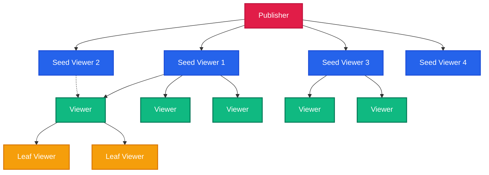

# AllRTC 🌐⚡️

> **Zero-Latency, P2P WebRTC CDN for Live Streaming**
> *Slash CDN costs by 95% while achieving sub-500ms global latency.*

[](https://mariadb.com/bsl11/)](https://www.gnu.org/licenses/agpl-3.0)
[](http://makeapullrequest.com)

AllRTC is an ultra-low latency, peer-to-peer (P2P) CDN for live video and audio broadcasting. By combining the lowest latency transport layer (WebRTC DataChannels) with a sophisticated swarm routing topology, AllRTC enables 1 broadcaster to stream to 30,000+ concurrent viewers with **under 500ms of end-to-end latency**—without expensive media servers (SFUs/MCUs).

---

## 🛑 The Problem

Live streaming today is broken:
1. **HLS/DASH is too slow:** 5-15 seconds of latency ruins interactive streams (betting, auctions, live gaming, HQ trivia).
2. **WebRTC SFUs are too expensive:** Scaling to 10,000 viewers with an SFU requires massive server farms. Bandwidth costs alone can exceed $10,000/month.
3. **P2P HLS/DASH still has high latency:** Existing P2P CDNs (like Peer5 or Streamroot) just distribute HLS chunks. They save bandwidth but *increase* latency.

## ✅ The AllRTC Solution

AllRTC entirely bypasses HLS/DASH and SFUs.

*   **Cost:** The publisher streams the video track exactly *once* to a handful of "seed" viewers. The viewers relay it to other viewers. **Your outbound server bandwidth is effectively 0.**
*   **Latency:** Video frames are chunked, serialized, and blasted over WebRTC DataChannels (UDP). No buffering, no waiting for keyframes. Latency is limited only by network physics (RTT).

### Cost Comparison (10,000 Viewers @ 1080p, 5Mbps, 4 hours)
| Technology | Bandwidth Needed | Est. AWS Cost | Latency |
| :--- | :--- | :--- | :--- |
| Traditional CDN (HLS) | 90,000 GB | $4,500.00 | 10,000ms+ |
| Managed WebRTC SFU | 90,000 GB | $9,000.00+ | ~300ms |
| **AllRTC** | **~50 GB (Tracker)**| **$0.05** | **~400ms** |

---

## 🏗️ P2P Swarm Architecture

AllRTC builds a shallow, high-fanout tree.



---

## 🚀 6 Latency Optimizations

1. **WebRTC DataChannels (UDP):** Bypasses TCP head-of-line blocking. Packets arrive out-of-order and are reassembled instantly.
2. **Zero-Delay Forwarding (Pipeline):** A viewer relays a chunk *the millisecond* it arrives, before even verifying its hash. Verification happens asynchronously.
3. **Geographic Proximity Routing:** The tracker assigns parents in the same IP /16 subnet (same ISP/City). Cross-node RTT drops from 100ms to <15ms.
4. **Shallow Swarm Depth:** Branching factor of 8. It only takes 5 hops to reach 32,000 viewers. (5 hops × 20ms = 100ms P2P propagation delay).
5. **No Chunk Buffering:** Unlike HLS which waits for a 2-second .ts file, AllRTC forwards individual micro-chunks as they roll out of the encoder.
6. **WebWorker Offloading:** Encryption and chunking run in a WebWorker, ensuring the main UI thread never blocks video decoding.

---

## 🛠️ 8 Technical Problems Solved

1. **The Churn Problem (Peers Disconnecting):** Solved via **Dual-Parent Redundancy**. Every peer connects to a Primary and Backup parent. If the primary disconnects, the backup takes over instantly. *Zero-freeze playback.*
2. **The Mobile Battery Problem:** Solved via **Smart Device Tiering**. Mobile phones or metered connections are assigned as "Leaves" only. They receive video but never upload, saving battery and data.
3. **The WebRTC Blocking Problem:** Solved via **WebSocket Relay Fallback**. If corporate firewalls block WebRTC UDP, AllRTC falls back to relaying video chunks through the tracker's wss:// connection (port 443).
4. **The Network Switch Problem:** Solved via **ICE Restarts**. Moving from WiFi to 4G seamlessly renegotiates connections without dropping the viewer.
5. **The Malicious Peer Problem:** Solved via **Async SHA-256 Signatures**. The publisher signs chunks. If a malicious peer injects bad data, the child detects the bad hash asynchronously and drops the connection.
6. **The Background Tab Problem:** Browsers sleep inactive tabs. Solved by injecting a silent `AudioContext` keepalive oscillator.
7. **The Head-Of-Line Blocking Problem:** DataChannels are configured `ordered: false, maxRetransmits: 0`. We care about *now*, not 2 seconds ago. Lost chunks are ignored.
8. **The Tracker Bottleneck Problem:** The tracker only handles signaling (`offer`/`answer`) and topology. It never touches media. A $5 VPS can handle 50,000 viewers.

---

## 🛡️ 3-Layer Anti-Blocking System

Network administrators hate P2P. AllRTC penetrates firewalls using three layers:
1. **Multi-Region STUN:** Free Google/Cloudflare STUN traverses 80% of NATs.
2. **TURN-over-TLS (Port 443):** By running TURN over TLS on port 443, traffic is indistinguishable from standard HTTPS web browsing. DPI engines cannot block it without blocking the whole internet.
3. **WebSocket Relay (WSS):** If UDP is completely banned, chunks are Base64 encoded and relayed via the WebSocket tracker.

---

## 📈 Scaling Math (Branching Factor 8)

Assuming the publisher connects to 8 seeds, and each peer relays to up to 8 children:

| Depth Layer | Concurrent Viewers at Layer | Total Swarm Size | Approx Network Propagation Latency |
| :--- | :--- | :--- | :--- |
| 0 (Publisher) | 1 | 1 | 0ms |
| 1 (Seeds) | 8 | 9 | ~30ms |
| 2 | 64 | 73 | ~60ms |
| 3 | 512 | 585 | ~90ms |
| 4 | 4,096 | 4,681 | ~120ms |
| 5 | 32,768 | 37,449 | ~150ms |
| 6 | 262,144 | 299,593 | ~180ms |

*300,000 viewers with less than 200ms of P2P network latency!*

---

## 🔒 Security Model

*   **Transport:** WebRTC DataChannels are heavily encrypted via DTLS by default. Tracker connections use WSS (TLS).
*   **Data Integrity:** The publisher generates an Ed25519 or SHA-256 manifest for every chunk. Viewers verify this hash asynchronously to ensure relays haven't tampered with the payload.
*   **Access Control:** The tracker supports session tokens to prevent unauthorized viewing.

---

## 💻 API Reference

### 1. The Publisher (Broadcaster)
```typescript
import { AllRTCPublisher } from 'allrtc-sdk';

const streamId = "live_event_123";
const trackerUrl = "wss://tracker.yourdomain.com/ws";

const publisher = new AllRTCPublisher(trackerUrl, streamId);

publisher.on('started', () => console.log('Live!'));
publisher.on('peer_connected', (id) => console.log(`Seed ${id} connected`));

// Get video stream from camera/canvas
const stream = await navigator.mediaDevices.getUserMedia({ video: true, audio: true });

// Start broadcasting!
publisher.start(stream);
```

### 2. The Viewer
```typescript
import { AllRTCViewer } from 'allrtc-sdk';

const streamId = "live_event_123";
const trackerUrl = "wss://tracker.yourdomain.com/ws";

const viewer = new AllRTCViewer(trackerUrl, streamId);

viewer.on('connected', () => console.log('Joined Swarm'));

// Attach the P2P video stream to a UI element
const videoEl = document.getElementById('myVideoElement');
videoEl.srcObject = viewer.getVideoElement().captureStream();
videoEl.play();

viewer.start();
```

---

## 🌐 Deployment Guide

### 1. Tracker Server (Go)
The tracker is a lightweight Go server that manages the swarm tree.

**Option A: Docker**
```bash
cd tracker/
docker build -t allrtc-tracker .
docker run -p 4001:4001 -e PORT=4001 allrtc-tracker
```

**Option B: Railway / Heroku**
Simply deploy the `tracker/` directory. It relies on standard environment variables (`PORT`). No database is required (it holds state in memory).

### 2. Turn Server (Optional but Highly Recommended)
For corporate firewalls, you should deploy `coturn`:
```bash
sudo apt install coturn
```
Configure `turnserver.conf` with:
```
listening-port=3478
tls-listening-port=443
```

---

## ⚔️ Competitor Comparison

| Feature | AllRTC | Traditional CDN | Peer5 / Streamroot | Managed SFU (LiveKit/Agora) |
| :--- | :--- | :--- | :--- | :--- |
| **End-to-End Latency** | **<500ms** | 10,000ms+ | 15,000ms+ | <300ms |
| **Bandwidth Cost** | **Effectively $0** | High | Medium | Very High |
| **Transport** | **WebRTC UDP Data** | HTTP (TCP) | HLS over WebRTC | WebRTC Media |
| **Relay Method** | **Chunk Pipeline** | .ts Segments | .ts Segments | Server Relay |
| **Smart Mobile Tiering**| **Yes** | N/A | Variable | N/A |
| **Zero-Freeze Redundancy**| **Dual-Parent** | Client retries | Client retries | Server side |

---

## ⚙️ Configuration Options

You can pass configuration objects to customize limits:

```typescript
const viewer = new AllRTCViewer(trackerUrl, streamId, {
    maxChildren: 8,           // Fan-out branching factor
    allowMobileRelay: false,  // Force false to save mobile battery
    webrtcTimeoutMs: 8000,    // Fallback to WS after 8s
});
```

---

## 🙋 FAQ

**Q: Does this replace my encoding pipeline?**
A: Yes and no. AllRTC Publisher grabs raw `MediaStream` tracks (from canvas, webcam, or video tags) and handles the micro-chunking/encoding.

**Q: Can viewers spoof being a mobile device to avoid uploading?**
A: Yes, but the Tracker monitors peer count. The system is designed such that even if 80% of viewers are "leeches" (mobile), a branching factor of 8 on the remaining 20% desktop users is enough to support the whole swarm.

**Q: What if the publisher drops?**
A: The tracker will gracefully tear down the swarm or wait for a publisher reconnection, based on your configured timeout.

---

## ⚖️ License — Business Source License 1.1 (BSL 1.1)

> **This is NOT open-source software. Source code is available for viewing, but ALL production use requires a paid license.**

This project uses the **[Business Source License 1.1](https://mariadb.com/bsl11/)** — the same license trusted by HashiCorp (Terraform), Sentry, CockroachDB, and MariaDB.

### What You CAN Do (Free)
- ✅ View, read, and study the source code
- ✅ Run for personal, non-commercial evaluation and testing
- ✅ Use for academic research and education
- ✅ Contribute improvements via pull requests

### What REQUIRES a Paid License
- 💰 Any production deployment
- 💰 Internal business tools
- 💰 SaaS / PaaS / API products
- 💰 Customer-facing applications
- 💰 Integration into any commercial product
- 💰 Any use within an organization with >1 employee

### ⚠️ Anti-Circumvention Protection
- 🔒 This license **CANNOT be removed** from forked or cloned copies
- 🔒 ALL derivative works inherit this license automatically
- 🔒 Removing copyright headers violates copyright law
- 🔒 Every source file contains embedded copyright notices

### 💼 Commercial License Pricing

| Tier | Price | For |
|:-----|:------|:----|
| **Indie** | $499/year | Solo developer, <$100K revenue |
| **Startup** | $2,999/year | Up to 25 employees, <$5M revenue |
| **Enterprise** | $14,999/year | Unlimited seats, unlimited revenue |
| **OEM / White-Label** | Custom pricing | Embedding in your product |
| **Full IP Buyout** | $500K+ | Complete intellectual property transfer |

### 📬 Contact for Licensing

**Soumya Debnath** — Creator & Sole Rights Holder

- 📧 Email: [soumyadebnath1661@gmail.com](mailto:soumyadebnath1661@gmail.com)
- 📞 Phone / WhatsApp: [+91 7031648617](tel:+917031648617)
- 🐙 GitHub: [github.com/itsoumya-d](https://github.com/itsoumya-d)

---
© 2024-2026 Soumya Debnath. All Rights Reserved.

