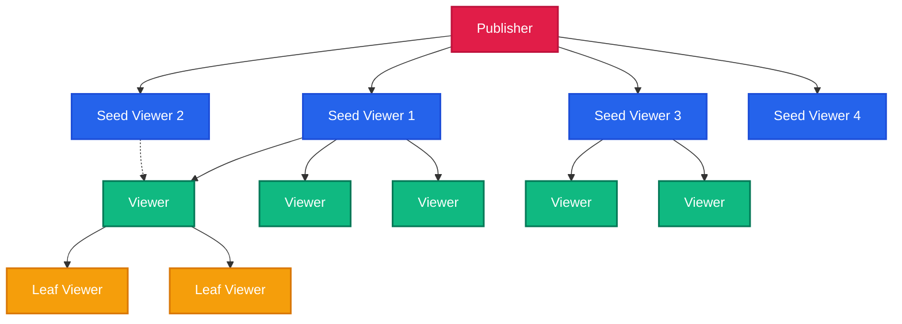

<!--
// Copyright (c) 2024-2026 Soumya Debnath. All Rights Reserved.
// Licensed under the Business Source License 1.1 (BSL 1.1).
// See LICENSE file for details. Production use requires a paid license.
// Contact: soumyadebnath1661@gmail.com | +91 7031648617
-->

# AllRTC

> **AllRTC redistributes a live video stream peer-to-peer among its viewers, so egress bandwidth grows far more slowly than the size of the audience.**

[](https://mariadb.com/bsl11/)
[](#known-limitations)

AllRTC is a peer-to-peer live video broadcasting library built on WebRTC DataChannels. The publisher streams to a small set of seed peers; each peer relays chunks to its own children, offloading server bandwidth. The tracker server handles signaling and topology only — it never touches media.

> **Note on quantitative claims:** AllRTC is pre-release software with no production deployments. Bandwidth, latency, cost, and viewer-count figures from earlier documentation were theoretical calculations, not measured results. UDP is blocked in this sandbox, so P2P performance cannot be measured here. All such figures have been removed. If you benchmark AllRTC in a real network environment, please open a PR with your methodology and hardware.

---

## The Problem

Live streaming today faces two conflicting constraints:
1. **HLS/DASH has high latency:** 5-15 seconds of latency is problematic for interactive streams (auctions, live gaming, trivia).
2. **WebRTC SFUs are expensive at scale:** Scaling to thousands of viewers with an SFU requires substantial server infrastructure.

## The AllRTC Approach

AllRTC bypasses HLS/DASH and SFUs by building a viewer relay swarm. The publisher streams once to a small set of "seed" viewers. Seeds relay to other viewers, who relay to further viewers. Server outbound bandwidth scales sublinearly with viewer count. How far this approach scales in practice depends on network conditions, viewer churn, NAT traversal success rates, and browser behavior — none of which have been measured in production.

---

## P2P Swarm Architecture

AllRTC builds a shallow, high-fanout tree.



---

## Latency Design Goals

AllRTC is designed around minimizing end-to-end latency through:

1. **WebRTC DataChannels (UDP):** Bypasses TCP head-of-line blocking. Packets arrive out-of-order and are reassembled.
2. **Zero-Delay Forwarding:** A viewer relays a chunk as soon as it arrives, before hash verification. Verification happens asynchronously.
3. **No Chunk Buffering:** Unlike HLS which waits for a multi-second `.ts` file, AllRTC forwards individual micro-chunks continuously.
4. **WebWorker Offloading:** Encryption and chunking run in a WebWorker, keeping the main UI thread free.
5. **Unordered DataChannels:** Configured `ordered: false, maxRetransmits: 0` — lost chunks are dropped rather than causing head-of-line blocking.

**Actual measured latency in your deployment depends on network conditions, geographic distribution, NAT traversal success, and hardware. No benchmarks have been run.**

---

## AV1 Video Encoding & Adaptive Bitrate

AllRTC is designed to use the WebCodecs API (`VideoEncoder`, `VideoDecoder`) for direct encoding, and supports AV1 codec configuration (`av01.0.05M.08`). WebCodecs AV1 hardware acceleration availability varies by browser and platform.

The `AdaptiveBitrateManager` class monitors DataChannel conditions per peer and adjusts encoding parameters. It is exported from the SDK and used by the publisher internally.

### Research Foundation
> W3C WebCodecs Working Group & Alliance for Open Media (AOMedia) (2023). *WebCodecs API Specification & AV1 Video Codec Specification for Real-Time Communications*. [w3.org/TR/webcodecs/](https://www.w3.org/TR/webcodecs/)

---

## Technical Problems Addressed

1. **Peer Disconnections:** Dual-Parent Redundancy. Every viewer connects to a Primary and Backup parent. If the primary disconnects, the backup takes over without freezing playback.
2. **Mobile Battery / Data:** Smart Device Tiering. Mobile phones or metered connections are assigned as "Leaves" only — they receive video but do not relay.
3. **WebRTC Blocking:** WebSocket Relay Fallback. If corporate firewalls block WebRTC UDP, AllRTC falls back to relaying video chunks through the tracker's WebSocket connection (port 443).
4. **Network Switching:** ICE Restarts. Moving from WiFi to 4G triggers `performIceRestart()`, which renegotiates ICE candidates without tearing down the peer connection.
5. **Data Integrity:** Async SHA-256 Signatures. The publisher signs chunks; viewers verify hashes asynchronously and drop connections from peers sending bad data.
6. **Background Tab Throttling:** A silent `AudioContext` oscillator (gain = 0) prevents the browser from sleeping inactive tabs.
7. **Tracker Bottleneck:** The tracker handles signaling only (`offer`/`answer`/`ice`) and never touches media data. A small server can handle a large swarm for signaling.

---

## Installation & Setup

> **AllRTC is not published on npm.** The package name `allrtc-sdk` does not exist. Do not run `npm install allrtc-sdk`. The package is `allrtc`, also not on npm.

### Option A: jsDelivr CDN from GitHub (no build step)

The SDK lives in `allrtc/sdk/`. The CDN path is:

```html
<script type="module">
  import { AllRTCPublisher, AllRTCViewer } from
    'https://cdn.jsdelivr.net/gh/itsoumya-d/allrtc@main/sdk/dist/index.mjs';
</script>
```

### Option B: Build from source

```bash
git clone https://github.com/itsoumya-d/allrtc.git
cd allrtc/sdk
npm install
npm run build
```

---

## API Reference

**Real exported symbols** (from `allrtc/sdk/src/index.ts`): `AllRTCPublisher`, `AllRTCViewer`, `AdaptiveBitrateManager`.

The class `AllRTCBroadcaster` does not exist. Earlier documentation referenced it incorrectly.

### 1. The Publisher (Broadcaster)
```typescript
import { AllRTCPublisher } from 'https://cdn.jsdelivr.net/gh/itsoumya-d/allrtc@main/sdk/dist/index.mjs';

const streamId = 'live_event_123';
const trackerUrl = 'wss://tracker.yourdomain.com/ws';

const publisher = new AllRTCPublisher(trackerUrl, streamId);

publisher.on('started', () => console.log('Live!'));
publisher.on('peer_connected', (id) => console.log(`Seed ${id} connected`));

const stream = await navigator.mediaDevices.getUserMedia({ video: true, audio: true });
publisher.start(stream);
```

### 2. The Viewer
```typescript
import { AllRTCViewer } from 'https://cdn.jsdelivr.net/gh/itsoumya-d/allrtc@main/sdk/dist/index.mjs';

const streamId = 'live_event_123';
const trackerUrl = 'wss://tracker.yourdomain.com/ws';

const viewer = new AllRTCViewer(trackerUrl, streamId);

viewer.on('connected', () => console.log('Joined Swarm'));

const videoEl = document.getElementById('myVideoElement');
videoEl.srcObject = viewer.getVideoElement().captureStream();
videoEl.play();

viewer.start();
```

---

## Deployment Guide

### 1. Tracker Server (Go)
The tracker is a lightweight Go server that manages the swarm tree.

**Option A: Docker**
```bash
cd tracker/
docker build -t allrtc-tracker .
docker run -p 4001:4001 -e PORT=4001 allrtc-tracker
```

**Option B: Railway / Heroku**
Deploy the `tracker/` directory. It relies on `PORT` environment variable. No database is required.

### 2. TURN Server (Strongly Recommended)
For corporate firewalls or symmetric NAT environments, deploy `coturn`:
```bash
sudo apt install coturn
```
Configure `turnserver.conf`:
```
listening-port=3478
tls-listening-port=443
```

---

## Security Model

- **Transport:** WebRTC DataChannels are encrypted via DTLS. Tracker connections use WSS (TLS).
- **Data Integrity:** The publisher generates a SHA-256 hash for every chunk. Viewers verify hashes asynchronously to detect relay tampering.
- **Access Control:** The tracker supports session tokens to prevent unauthorized viewing.

---

## Configuration Options

```typescript
const viewer = new AllRTCViewer(trackerUrl, streamId, {
    maxChildren: 8,           // Fan-out branching factor
    allowMobileRelay: false,  // Force false to save mobile battery
    webrtcTimeoutMs: 8000,    // Fallback to WS after 8s
});
```

---

## Known Limitations

- **Pre-release software.** No production deployments are known. API may change.
- **Not published on npm.** Neither `allrtc` nor `allrtc-sdk` is on npm. Use jsDelivr CDN or build from source.
- **No TURN relay configured by default — connections fail behind symmetric or carrier-grade NAT.** The default ICE configuration uses STUN servers only (Google and Cloudflare). STUN cannot traverse symmetric NAT (common on corporate networks) or many mobile carrier-grade NAT deployments; those peers cannot connect at all. The README mentions TURN-over-TLS as a feature, but the actual `iceServers` array in `peer-manager.ts` has the TURN entry commented out with placeholder credentials. No relay is active unless you deploy your own TURN server and configure the credentials. When ICE fails, the code emits a generic `'disconnected'` event — callers cannot distinguish "NAT traversal failed" from "peer voluntarily left". If you need reliable connectivity across arbitrary networks, deploy `coturn` and pass your TURN credentials in the `iceServers` config.
- **All bandwidth and viewer-count claims have been removed.** Earlier documentation claimed figures like "30,000+ concurrent viewers", "$0.05 AWS cost", "95% CDN cost reduction", "<500ms end-to-end latency", and scaling tables with exact propagation delays. These were theoretical calculations. AllRTC has not been benchmarked in production. UDP is blocked in this build environment, so no measurements can be made here. Do not rely on these figures for production capacity planning.
- **WebCodecs AV1 is not universally available.** Support varies by browser, OS, and GPU. Chrome on desktop generally supports hardware-accelerated AV1 encoding; Firefox and Safari support is partial or absent as of 2025.
- **Browser-only SDK.** The SDK uses `MediaStream`, `RTCPeerConnection`, and `WebCodecs` APIs that are unavailable in Node.js.

---

## Competitor Comparison

| Feature | AllRTC | Traditional CDN | Managed SFU (LiveKit/Agora) |
| :--- | :--- | :--- | :--- |
| **Transport** | WebRTC UDP DataChannels | HTTP (TCP) | WebRTC Media |
| **Relay Method** | Chunk Pipeline (P2P) | .ts Segments | Server Relay |
| **Server Bandwidth at Scale** | Near-zero (shifts to peers) | Linear with viewers | Linear with viewers |
| **Latency** | Network-dependent (not measured) | 5-15s (HLS) | ~300ms |
| **Smart Mobile Tiering** | Yes | N/A | N/A |
| **TURN Required for Reliability** | Yes | N/A | N/A |

---

## FAQ

**Q: Does this replace my encoding pipeline?**
A: AllRTC Publisher grabs raw `MediaStream` tracks (from canvas, webcam, or video tags) and handles micro-chunking/encoding via WebCodecs.

**Q: Can viewers spoof being a mobile device to avoid uploading?**
A: Yes, but the Tracker monitors peer count. The system is designed such that even if a large fraction of viewers are leaves, the remaining relay-capable viewers sustain the swarm. The exact resilience depends on your branching factor and churn rate.

**Q: What if the publisher drops?**
A: The tracker will gracefully tear down the swarm or wait for a publisher reconnection, based on your configured timeout.

---

## License — Business Source License 1.1

> **Source-available, NOT open-source. All production use requires a paid license.**
> Replaces: Cloudflare Stream, AWS IVS

| Tier | Price | For |
|:-----|:------|:----|
| **Indie** | $799/year | Solo developer, <$100K revenue |
| **Startup** | $4,999/year | Up to 10-25 devs, <$5M revenue |
| **Enterprise** | $24,999/year | Unlimited seats, unlimited revenue |
| **OEM / White-Label** | $49,999/year | Embed in your product |
| **Full IP Buyout** | $2,000,000 | Complete ownership transfer |

**Free use limited to:** Personal evaluation, academic research, contributing via PRs.

[soumyadebnath1661@gmail.com](mailto:soumyadebnath1661@gmail.com) · [+91 7031648617](tel:+917031648617) · [github.com/itsoumya-d](https://github.com/itsoumya-d)

© 2024-2026 Soumya Debnath. All Rights Reserved.
